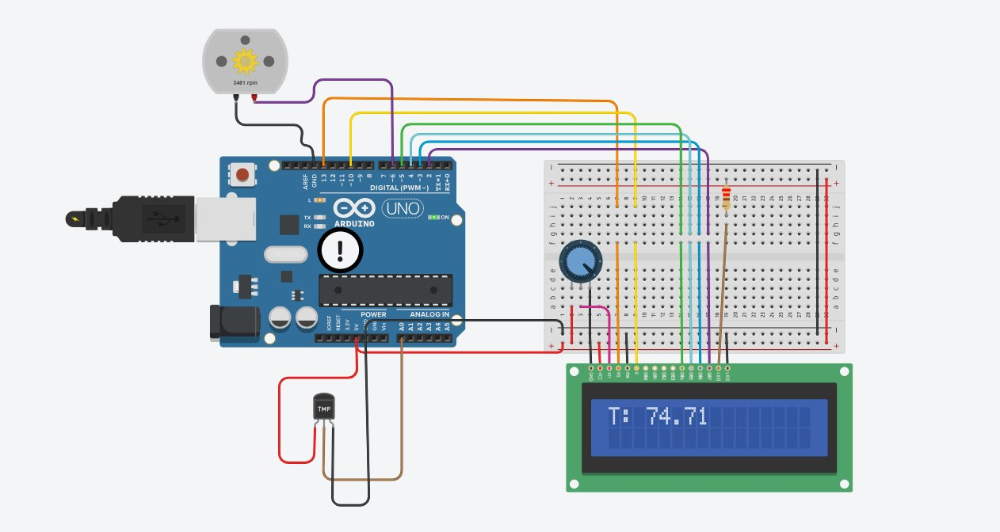

# 🌡️ Arduino-Based Smart Temperature Monitoring and Fan Automation System

A simulation-based project built on **Autodesk Tinkercad** that uses an Arduino UNO to monitor ambient temperature via a TMP sensor and automatically control a DC fan speed, while displaying the real-time temperature on a **16x2 LCD screen**.

---

## 📌 Overview

This project is the digital/microcontroller counterpart to an analog fan control design. An Arduino reads temperature data from a TMP sensor, displays it live on an LCD, and drives a DC fan at variable speed using PWM — all simulated in **Autodesk Tinkercad**.

---

## 🖥️ Simulation Platform

| Tool | Details |
|------|---------|
| Platform | Autodesk Tinkercad |
| Type | Circuit + Code Simulation |
| Board | Arduino UNO |

---

## 🖼️ Simulation Screenshot



> The LCD displays real-time temperature (e.g. `T: 74.71`) while the fan spins at speed proportional to the temperature reading.

---

## ⚙️ How It Works

```
[TMP Temperature Sensor]
          │
          ▼
 [Arduino UNO - Analog Pin A0]
          │
    ┌─────┴──────┐
    ▼            ▼
[DC Fan via   [16x2 LCD Display]
 Transistor]   Shows "T: XX.XX"
 PWM Speed
 Control
```

1. **Sensing:** The TMP sensor outputs an analog voltage read by Arduino's ADC on pin A0.
2. **Processing:** Arduino converts the raw value to °C and maps it to a fan speed.
3. **Display:** The 16x2 LCD continuously shows the current temperature reading.
4. **Fan Control:** Fan speed is controlled via PWM — higher temperature = faster fan.

---

## 🌡️ Temperature Thresholds

| Temperature | Fan State  | LCD Display  |
|-------------|------------|--------------|
| Below 30°C  | OFF        | `T: XX.XX`   |
| 30°C – 40°C | LOW speed  | `T: XX.XX`   |
| Above 40°C  | HIGH speed | `T: XX.XX`   |

---

## 🧰 Components Used (Tinkercad Simulation)

| Component | Quantity | Purpose |
|-----------|----------|---------|
| Arduino UNO | 1 | Main microcontroller |
| TMP Temperature Sensor | 1 | Analog temperature sensing |
| DC Motor (Fan) | 1 | Cooling fan (PWM controlled) |
| NPN Transistor | 1 | Fan motor driver |
| 16x2 LCD Display | 1 | Real-time temperature display |
| Potentiometer | 1 | LCD contrast adjustment |
| Resistors | 2–3 | Current limiting / base resistor |
| Breadboard | 1 | Circuit assembly |
| Jumper Wires | Multiple | Connections |
| Power Supply (5V) | 1 | Via Arduino USB |

---

## 💻 Arduino Code

The main sketch is located in the `/src` folder:

```
/src
  └── temperature_fan_control.ino
```

### Code Logic Summary

```cpp
readTemperature();        // Read TMP sensor → convert to °C
lcd.print("T: ");
lcd.print(temperature);   // Display on LCD

if (temp > 40)
  analogWrite(FAN_PIN, 255);   // Full speed
else if (temp > 30)
  analogWrite(FAN_PIN, 120);   // Low speed
else
  analogWrite(FAN_PIN, 0);     // Fan off
```

---

## 📁 Repository Structure

```
arduino-temperature-fan-automation/
├── src/
│   └── temperature_fan_control.ino
├── simulation/
│   └── tinkercad_simulation.png
├── README.md
├── TROUBLESHOOTING.md
└── LICENSE
```

---

## 🚀 Getting Started

### Run in Tinkercad (Simulation)
1. Open [Autodesk Tinkercad](https://www.tinkercad.com)
2. Recreate the circuit as shown in the simulation screenshot
3. Paste the `.ino` code into the code editor
4. Click **"Start Simulation"**
5. Click on the TMP sensor and drag the temperature slider to see the fan and LCD respond

### Run on Real Hardware
1. Assemble the circuit on a breadboard as shown in the screenshot
2. Open the `.ino` file in **Arduino IDE**
3. Install the **LiquidCrystal** library if not already present
4. Connect your Arduino UNO via USB
5. Select the correct **Board** and **Port**
6. Click **Upload**

---


## 📄 License

This project is licensed under the **Creative Commons Attribution 4.0 International (CC BY 4.0)** license.
You are free to share and adapt this work as long as appropriate credit is given.

See the [LICENSE](LICENSE) file for full details.

---

## 👤 Author

**Mamoon**  
Robotics Engineering Student

---

## 🙏 Acknowledgements

- Simulation Tool: [Autodesk Tinkercad](https://www.tinkercad.com)
- References: Arduino documentation and analog electronics coursework
